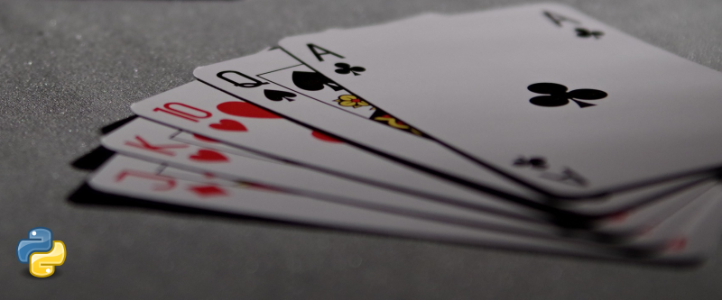

# Texas Holdem Hand Checker
An implementation of (Texas Holdem) Poker hand checker in Python3 programmed using ping-pong methodology of team collaboration between 2.

[Original Kata](https://codingdojo.org/kata/PokerHands/),'Coding Dojo Texa Hand Cheker Kata')

The program deals with 2 hands, in this case black and white and termines the winner.
The hands are passed as a single string in the format:

```Black: 2H 4S 4C 2D 4H  White: 2S 8S AS QS 3S```

The colour hand, their 5 cards represented by card and suit.  
```J, Q, K represent the royal cards```.  
Also worth noting that Aces ```'A'``` are high in Poker hands.

## Requirements
The program is required to determine the winning hand (black, white or in very rare cases a draw).  Each hand is assigned by a colour.  The program is passed a single string containing the players hands of 5 cards. The program will allow for several players, enough for a sensible game (Tested with 4).

Each players hand is determined based on the following ascending criteria of importance/value.

+ High Card: Hands which do not fit any higher category are ranked by the value of their highest card. If the highest cards have the same value, the hands are ranked by the next highest, and so on.
+ A single Pair: 2 of the 5 cards in the hand have the same value. Hands which both contain a pair are ranked by the value of the cards forming the pair. If these values are the same, the hands are ranked by the values of the cards not forming the pair, in decreasing order.
+ Two Pairs: The hand contains 2 different pairs. Hands which both contain 2 pairs are ranked by the value of their highest pair. Hands with the same highest pair are ranked by the value of their other pair. If these values are the same the hands are ranked by the value of the remaining card.
+ Three of a Kind: Three of the cards in the hand have the same value. Hands which both contain three of a kind are ranked by the value of the 3 cards.
+ Straight: Hand contains 5 cards with consecutive values. Hands which both contain a straight are ranked by their highest card.
+ Flush: Hand contains 5 cards of the same suit. Hands which are both flushes are ranked using the rules for High Card.
+ Full House: 3 cards of the same value, with the remaining 2 cards forming a pair. Ranked by the value of the 3 cards.
+ Four of a kind: 4 cards with the same value. Ranked by the value of the 4 cards.
+ Straight flush: 5 cards of the same suit with consecutive values. Ranked by the highest card in the hand


## Approach
A ```Test Driven Design``` approach was used to handle this solution.  

Basic code was created to pass testing for a ```Flush``` of the 5 cards (for a single player).  Similar tests would be created for each type of hand based on a single set of cards that could later be scaled up to catering for both players.  Initially the system only handled the basic case of the 5 cards of one hand.  No player colour etc, just the 5 cards in a single string of the form ```<Value><Suit>``` e.g. ```'2H 3S 4D 5C 6D'```

### Decisions and Limitations
A card class was created the handle each card, allowing the card objects to have a suit and value ```(later high values were assigned 10,11,12,13 and 14 for T,J,Q,K and A respectively)```

To test for different suits the hand was examined by each card, it was tested to see if it was already one of the ```'key'``` values of unique_suits(of the hand).  This allowed a dictionary of card suits and how many cards in the hand are of that particular suit.  For the flush the dictionary for the hand should only hold one 'key' being the suit and a value of 5 to show that each card of was of that single suit.

The remainder of checks for winning hands were mostly based on the unique card values.  

The 'Straight' has the intresting generic property that the ```lowest card value must be 4 less than the highest card value```, this generic fact allowed for generic testing through all card values (using the previously mentioned numeric values for royal cards, Ace being high).

For 4 of a kind a similar approach was taken to analyse the values of the cards and add them to a dictonary (unique_card_values) the numeric values of the cards as the keys and then count of that number for the values, for 4 of a kind ```one of the values of dictionary has to be 4```, later this value could be returned to calculate the winner if both players had 4 of a kind (one hand would have to be higher as playing with only 1 pack of cards means both players couldn't have hands that would draw with 4 of a kind, similarly for 3 of a kind).

A hand object was then created and there was discussion about what information the hand would hold and ```'know about itself'```.  Individual tests were carried out on the hand object to test for each of the other winning hands.  The hand object can report the hightest value ```'poker hand'``` it contains and also the ```highest card value``` in the case of tie breaker.

This was then devloped into testing a pair of poker hand objects against each other.  Once each players 'poker hand' was determined from their cards they could be compared in order of importance. ```(order see above)```, testing in desceding order (the most important hand first).  This allowed a series of tests to be created for a pair of hands and worked out which was the winner.

The ```'draw'``` scenarios were the last and most complex part to calculate.  First determining where a draw occurs depending upon the ```'poker hand'``` was actually possible for example the straight flush (technically this could be a draw but is statistically very unlikely!), four of a kind, full house cannot have a draw due to card limits.

For ```2 pairs``` if the highest pair of each hand match you can compare the ```2nd pair``` (again it is unlikely that these will be equal)

One possible solution to finding the winning would/could be an iterative process where the 'poker hand' is removed and the remainder compared using the existing checks that take place for hands.  The hand object is aware of the cards that remain after the 'poker hand' for comparison.  After discussion it was decided this would not be the best idea, where possible keep the poker hands complete and find another way to iterate.


During refactoring it was decided to use an Enum (Dictionary of the Poker hands) so that if code would have to be slightly tweaked or modified it would only have to be changed in fewer places, as reference would refer to these static values.


### Possible Expansions of the project
+ A simple interface where the hands could be passed.

### Dependencies
All code was generated and run in Python 3.x using the [Pytest Framework](https://docs.pytest.org/en/6.2.x/, 'Pytest Guidance') in Visual code.
Install Python3.x from the python website for your system.
[Python Home](https://www.python.org/, 'Python Main Site')

```N.B.  Python 3.x now includes a standard enum library.```

To install pytest in Python use
```pip install -U pytest```

### Getting Started
- Clone this repo
- Navigate to the directory
- Within Python Environment (I used Visual Code) run pytest

#### Usage
import the check_hand function from poker hands
```from poker_hands import check_hand```
then call the check_hand function by passing the string that contains the hand colour and 5 cards
e.g. 'Black: 2H 4S 4C 2D 4H  White: 2S 8S AS QS 3S' N.B. there is a double space between the hands.
e.g. ```winner = check_hands('Black: 2H 4S 4C 2D 4H  White: 2S 8S AS QS 3S')```

### Testing
You will find included test files for both the hands object and the checking of poker_hands
You can run all tests by using ```pytest -s``` to get the outputs.

To run an individual test simply invoke pytest with -k switch and specify the string, or partial string of the testname you wish to card out.
e.g. ```pytest -k "each_player"``` will run the 8 tests that deal with each player having similar hands.


## Reflections
This was my first real attempt of working closely with someone else on a single project together.  I found this process very interesting and rewarding.  I had some clear ideas of how I wanted to approach this however I really had to 'scale back' many of these ideas and start from a much simpler place, this let the code develop over time through the various sessions we worked upon this.  This approach of taking smaller chunks and simpler tests meant that code could be more easily refactored, checked and then made generic and simplified.  Working with someone else also meant that I could talk through and justify some of my design choices and reasoning, I would then get alternative view or suggestions and considerations that I had not thought about.  An agreement upon the next steps was then discussed and agreed upon.  I really liked this way of working and learnt a great deal throughout the process and really appreciated the communication required throughout.  

From a coding point of view I had never come across 'enums' or their usage and learnt the benefits of only having to change code in a limited number of places by using references to it throughout the code.  This was also good practice of using dictionaries and keys to count and calculate.  It was also a good reminder of using objects and classes to structure the data and make the code more readable and legible to others.

This is one of the larger, more complicated project I have done with 100+ lines of test code and 35 individual tests and a couple of hundred lines of carefully considered and refactored code.

I also realised quite late into the project that I hadn't strictly been following the PEP8 guidelines, installed an appropriate linter for Python and cleaned up the code, this mean splitting several of the more complex lines with a ***\\** something I had not really practised to stay within the 70 char per line limit.

I took a good chunk of time at the end of the project to refactor several of the larger sections of my code trying to work more towards readable and simple to understand code.  I also discovered there is not 'switch or case statment' in Python I ended up with a rather large if/elif/else statement, but it tried to make this as simple to follow as possible.